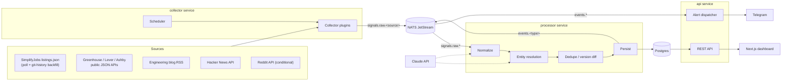

# ReqRadar — Design Document

*Watchlist-first hiring intelligence: radar for job reqs at your target companies.*

**Author:** Mark Mairs · **Date:** June 12, 2026 · **Status:** Locked for v1 build

---

## 1. Problem statement and goals

### The product problem

Internship recruiting is timing-driven: Summer 2027 applications at major tech companies open in a staggered July–November 2026 window (Amazon Jul–Aug, Microsoft mid-Aug, Meta early Sep, Google ~Oct), windows creep year over year, and applying within the first two weeks of a posting measurably matters. Existing tools (Simplify, jobright.ai) are *applicant-workflow* products — autofill, trackers, matching. None offer **company-centric intelligence**: for a watchlist of target companies, when do they historically open applications, what changed in their job descriptions, what are engineers saying about them, and an alert the moment something moves.

This platform is watchlist-first: the user bookmarks ~15 target companies and the system aggregates historical and real-time hiring signals per company, with Telegram alerts on changes.

### The resume problem (the real goal)

My resume reads as gamedev + applied AI (shipped Roblox game with 830K+ plays, agentic AI internship at SAS, Claude API in production). SWE intern JDs at my target companies ask for: distributed systems, scalable backend services, real-time data processing, CI/CD, API design, database/data systems. This project demonstrates each of those with defensible, specific bullets — to pass ATS keyword filters and to give deep material for "tell me about a project" interviews.

**Honest calibration (from verified research):** personal projects are not a verified primary signal in intern hiring — DSA prep, referrals, and applying early dominate. What *is* verified is the downside risk: over-engineering reads as junior, and interviewers probe every technology named on a resume. Two design consequences:

1. Every component must survive the question "why not something simpler?" — the rejected-alternatives section (§10) is load-bearing, not decorative.
2. The build must not cannibalize application season. The system's own thesis says apps open starting July; the demoable core ships before that.

### Lineage: job-watch (the predecessor)

ReqRadar supersedes **job-watch** (github.com/Mekski/job-watch) — a Python Telegram bot that polls the SimplifyJobs/vanshb03 README tables from a GitHub Action and DMs new SWE-internship rows, with a "Mark as Applied" button that logs to a Google Sheet. ReqRadar absorbs it and carries forward three concrete lessons:

- **Emoji-normalized dedup.** job-watch strips Simplify's 🔥/🎓/🛂/🇺🇸 markers before hashing a row, because Simplify flips those markers on *existing* postings and a naive hash re-alerts. ReqRadar's `ContentHash` must canonicalize the same way (§3.1) — this is a hard-won requirement, not a nicety.
- **Own scheduler, not Actions cron.** job-watch needed an external every-minute trigger (cron-job.org) because GitHub's `schedule:` is throttled to ~hourly on fresh public repos, which is incompatible with sub-minute latency. ReqRadar runs its own scheduler on the VM — part of why the collector service exists at all.
- **The apply-loop.** job-watch's "Mark as Applied" button is the seed of ReqRadar's in-app application tracker (§4 planned table, §9 Milestone C).

The interview arc this gives you: *a working single-file Telegram bot, re-architected into an event-driven multi-service system once it outgrew its shape.* That's a stronger story than either project alone.

### Goals

- Per watchlisted company: historical application-opening timing patterns (3 years of backfilled data), currently open postings, JD version diffs, posted pay ranges, engineering-blog and HN/Reddit signal summaries.
- Sub-minute **detection-to-alert** latency, instrumented per hop. (Most sources are polled; end-to-end latency from *posting* is bounded by poll interval. The claim we make and measure is detection → Telegram.)
- A real multi-service event-driven pipeline, a real plugin architecture, a real CI/CD pipeline — each defensible at the volume we actually have.

### Non-goals (v1)

- Multi-user. Single user (me). Schema leaves the seam (§4) but no auth flows, no signup.
- Recruiter enrichment (Apollo/Clearbit/RocketReach). Deferred to v2: ToS unverified, privacy exposure, marginal value single-user. The entity registry is person-aware from day one so this bolts on later.
- X/Twitter collector. No free API tier since Feb 2026 ($0.005/post read). Replaced by Hacker News.
- Levels.fyi-style comp aggregation. Their data is crowdsourced from verified offers and cannot be legally reproduced. Reframed: extract **posted pay ranges** from JDs (mandated in CA/WA/NY/CO), trend them over time.
- Browse/search UX. Watchlist-first is the differentiation; Simplify already owns browse.
- Kubernetes, serverless, managed cloud databases.

---

## 2. System overview

Three Go services connected by NATS JetStream, one Postgres database, a Next.js dashboard, Telegram for alerts. Single VM, Docker Compose.



**Why three services and not a monolith?** Honestly: a Go monolith with goroutines would work at this scale, and I say so in interviews. The split buys three real things: (1) failure isolation — a panicking HTML parser in a collector cannot take down alert delivery; (2) independent deploy/restart — collectors redeploy several times a week as sources change; the alert path shouldn't bounce with them; (3) backpressure decoupling — backfill floods (24K commits of history) are absorbed by JetStream instead of blocking the API. It is explicitly *not* about horizontal scale, and I never claim it is.

**Why NATS and not a Postgres job queue?** A Postgres queue (`SELECT ... FOR UPDATE SKIP LOCKED`) handles the throughput fine. NATS buys: typed subject hierarchy with independent consumers (the alerter and the persister consume the same events without coordinating), JetStream replay (re-run the processor over raw signals after a parser fix — this is used constantly during development), and it's a single ~15 MB binary with no ops weight. Kafka was rejected as pure ops cost at this volume (§10).

---

## 3. Service-by-service breakdown

### 3.1 `collector`

Runs all collector plugins on schedules. Owns nothing but source credentials and last-run state; publishes everything to NATS.

**The Collector interface** (the heart of the plugin architecture):

```go
// RawSignal is the universal envelope every collector emits.
type RawSignal struct {
    Source      string          // "simplify-listings", "greenhouse", "hn", ...
    ExternalID  string          // source-native ID for idempotency/dedup
    Kind        SignalKind      // posting, blog_post, discussion, ...
    EventTime   time.Time       // when the thing happened (may be years ago: backfill)
    ObservedAt  time.Time       // when we saw it (t0 for the latency claim)
    Payload     json.RawMessage // source-native body, parsed downstream
    ContentHash string          // sha256 of canonicalized payload, for change detection
}

type Collector interface {
    Name() string
    Schedule() time.Duration                       // poll interval
    Collect(ctx context.Context, since time.Time) ([]RawSignal, error)
}

// Optional capability: collectors that can reconstruct history implement this.
type Backfiller interface {
    Backfill(ctx context.Context, from, to time.Time, emit func(RawSignal) error) error
}
```

Design rules:

- **Collectors do not parse semantics.** They fetch, stamp, hash, and emit. All interpretation lives in the processor — so a parsing bug is fixed once and replayed over stored raw signals, never re-fetched.
- **Source loss is non-fatal.** Each plugin runs in its own goroutine with panic recovery; a dead source flips its `sources.enabled` health flag and pages via Telegram, nothing else stops. (Required because Reddit's API terms are unverified — that collector may never ship.)
- **Per-source rate limiting** via `golang.org/x/time/rate`, configured per plugin. Respect robots.txt and published API limits; never authenticate to scrape; never fabricate accounts (the hiQ lesson — §10).
- **Canonicalize before hashing.** `ContentHash` is computed over a *normalized* payload — strip volatile markers (e.g. Simplify's 🔥/🎓/🛂/🇺🇸 emoji flags) that flip without the posting actually changing. Skipping this causes phantom re-alerts; it's the load-bearing lesson inherited from job-watch (§1 Lineage).
- Adding a source = one file implementing `Collector` + one row in `sources` config. That's the demo of "adding a new source is cheap."

**v1 plugin roster (priority order):**

| Plugin | Mechanism | Covers |
|---|---|---|
| `simplify-listings` | Poll `.github/scripts/listings.json` (live `dev` branch); `Backfiller` **samples git-history snapshots** (~60-day cadence back to Aug 2023) — the current file only holds the live cycle (~8 mo), so multi-year history needs past commits. Each listing carries epoch `date_posted`. | All big-tech posting detection + ~3 years of timing history |
| `greenhouse` | `boards-api.greenhouse.io/v1/boards/{org}/jobs?content=true` per configured org | **Verified: Roblox, Anthropic, xAI, Riot, Epic** (5 of watchlist) |
| `ashby` | `api.ashbyhq.com/posting-api/job-board/{org}` | **Verified: OpenAI, Notion** (2 of watchlist) |
| `rss` | Standard RSS/Atom polling | Engineering blogs (hiring intent + culture signal) |
| `hn` | Firebase HN API: company mentions + monthly Who-is-hiring threads | Sentiment + hiring chatter (replaces X) |
| `reddit` | Official OAuth API — **ToS verified VIABLE (see WATCHLIST.md): inference-only, segregated deletable storage required** | r/csMajors, r/cscareerquestions company threads |
| `vanshb03` | Same shape as simplify-listings, second aggregator | Cross-check / coverage |

`lever` was in the original roster but **no watchlist company uses Lever** (verified 2026-06-13), so it is cut from the v1 build. The framework supports adding it in one file when a future watchlist company needs it.

The per-company ATS mapping is **done** — see [WATCHLIST.md](WATCHLIST.md), verified by probing live job APIs (not eyeballed). Result: two collectors (`greenhouse` + `ashby`) cover 7 of 15 companies including 6 of the top targets; the other 8 are proprietary and ride the SimplifyJobs aggregator as designed.

### 3.2 `processor`

Consumes `signals.raw.*`, owns all interpretation, writes Postgres, emits enriched `events.*`.

Pipeline stages (sequential per message, concurrent across messages):

1. **Normalize** — parse source-native payload into a typed internal struct per `SignalKind`. Extract title, locations, pay range (transparency-state JDs), apply URL, body text.
2. **Entity resolution** — map raw company strings to registry entities (§6).
3. **Dedupe / diff** — `ExternalID + ContentHash` against stored state. New posting → `posting_opened`. Known posting, changed hash → store a new `posting_versions` row, emit `jd_changed` with a computed diff. Disappeared for N consecutive polls → `posting_closed`.
4. **Enrich** — for discussion-kind signals, batch per company per day through Claude API for sentiment/summary (§3.4).
5. **Persist + emit** — write rows, publish `events.<type>` with `entity_id` for downstream consumers.

Idempotency rule: processing is a pure function of (raw signal, current DB state); replaying a JetStream stream is always safe.

**Implementation status (task 7, 2026-06-14) — what's built and what's deferred:**
- Built: durable consumer, per-source normalizers (`internal/processor`), deterministic resolution (alias → domain) with watchlist filter, transaction-per-signal dedupe emitting `posting_opened` / `jd_changed`, idempotent on redelivery (change detection reads committed state).
- **Deferred — LLM resolution (cascade step 4):** the deterministic alias/domain match already resolves all watchlist companies (they're seeded with aliases); the LLM is only for the ambiguous long tail, which resolves to "not a watchlist entity" anyway. Add when a real miss appears.
- **Deferred — `posting_closed` detection:** requires reconciling "seen this poll" vs stored open postings; a batch concern, not streaming. Only `posting_opened`/`jd_changed` emit today.
- **Deferred — pay-range extraction:** Milestone C (§9 item 17); `postings.pay_*` stay null.
- **Deviation — `raw_signals` stores watchlist-resolved signals only** (not every ingested signal): keeps the replay buffer lean (104/poll vs 1,404) and aligned with what's persisted. Not lossy in practice — the collector re-emits all active listings each change, so a newly-watchlisted company reappears within one poll.

**Two-tier alerting (added 2026-06-14):** the watchlist-first design covers *intelligence* (timing, JD diffs, dashboard) but a job-seeker still wants broad "new internship" alerts for companies outside the 15 — this is what the predecessor job-watch did, so ReqRadar must match it or it regresses.
- **Tier 1 — watchlist (the 15):** full pipeline (entity, postings, versions, events, timing) + alerts on all internship categories.
- **Tier 2 — firehose (everyone else):** when a posting does NOT resolve to a watchlist entity AND its category is in the SWE+AI/ML set, the processor records it in a lightweight `firehose_seen` table and, if new, emits `events.firehose`; the dispatcher sends a 🆕 alert to all users. No entity/timing — alert-only. Verified: primed 944 active postings silently, then exactly one simulated-new TikTok posting alerted.
- **Priming:** `cmd/firehose-prime` records the current active backlog into `firehose_seen` without alerting (run once before arming), so the ~1,000 already-open postings don't all alert — job-watch's state-seed equivalent. It skips watchlist companies so the table stays non-watchlist-only.

### 3.3 `api`

Two responsibilities in one binary (split documented as a considered-and-rejected fourth service — at one consumer and one user it's a config line, not a service):

- **REST API** for the dashboard: `GET /companies/:id/timeline`, `/companies/:id/postings`, `/postings/:id/versions` (diff pairs), `/companies/:id/timing` (historical open-window aggregation), `/watchlist`, `/health/sources`.
- **Alert dispatcher**: JetStream consumer on `events.*`, filters against watchlist + per-company alert config, sends Telegram messages, records `alerts` row with per-hop latency (ObservedAt → processed → alerted). This is the instrumentation behind the sub-minute claim.

**Auth (v1):** the dashboard and API sit behind Caddy with basic auth; the API additionally checks a static bearer token. All user-scoped tables carry `user_id` from day one (one row in `users`). Multi-user later means adding session auth, not a schema migration.

**Backfill-vs-alert guard (decided + verified 2026-06-14):** the dispatcher's `events.*` consumer uses JetStream **`DeliverNew`**, so only events published after it starts are delivered — historical/backfill events already in the stream never alert. The originally-planned "ignore `event_time` older than 24h" filter was rejected: a *newly detected* posting can carry an old `date_posted` (it was posted weeks ago but just appeared in the aggregator), so a time filter would wrongly suppress real alerts. `detect_to_alert_ms` is measured from the signal's `ObservedAt` (collector detection) to send; in a healthy live system this is sub-second (verified 607ms). A large value means signals sat queued (e.g. processor was down) — honest, not a bug.

### 3.4 LLM usage (Claude API)

Three call sites, all non-blocking for the alert path:

- **Entity disambiguation fallback** (§6) — rare by design; cached forever.
- **Sentiment/summary** — discussion signals batched per (company, day); one call summarizes the batch. ~15 companies × a few threads/day ≈ tens of calls/day on Sonnet ≈ single-digit dollars/month. Prompt caching on the fixed instruction prefix.
- **JD semantic diff annotation** (stretch) — given a textual diff, one sentence on what materially changed ("added Go to requirements, removed GPA cutoff").

Hybrid/local inference was rejected for v1: at this volume the engineering cost buys nothing (§10).

---

## 4. Data model (Postgres — the only database)

ClickHouse was evaluated and rejected: the entire 3-year backfill is one 12.5 MB JSON file's history; steady-state volume is a few thousand events/day. Postgres with monthly partitions on the two append-heavy tables handles this for decades on one VM. (Full argument: §10.)

```sql
-- ===== Entity registry (person-aware from day one; v1 stores companies) =====
CREATE TYPE entity_kind AS ENUM ('company', 'person');
CREATE TABLE entities (
  id          BIGINT GENERATED ALWAYS AS IDENTITY PRIMARY KEY,
  kind        entity_kind NOT NULL,
  canonical_name TEXT NOT NULL,
  domain      TEXT,                  -- primary careers/web domain, strong resolver key
  metadata    JSONB NOT NULL DEFAULT '{}',
  created_at  TIMESTAMPTZ NOT NULL DEFAULT now()
);
CREATE TABLE entity_aliases (
  entity_id   BIGINT NOT NULL REFERENCES entities(id),
  alias       TEXT NOT NULL,         -- normalized: lower, stripped punctuation/suffixes
  source      TEXT NOT NULL,         -- 'seed' | 'llm' | 'manual'
  confidence  REAL NOT NULL DEFAULT 1.0,
  PRIMARY KEY (entity_id, alias)
);
CREATE UNIQUE INDEX ON entity_aliases (alias);  -- an alias maps to exactly one entity
CREATE TABLE resolution_decisions (              -- versioned audit log; never deleted
  id          BIGINT GENERATED ALWAYS AS IDENTITY PRIMARY KEY,
  raw_text    TEXT NOT NULL,
  entity_id   BIGINT REFERENCES entities(id),   -- NULL = resolved to "not a watchlist entity"
  method      TEXT NOT NULL,                     -- 'exact' | 'alias' | 'domain' | 'llm'
  confidence  REAL NOT NULL,
  model       TEXT,                              -- claude model id when method='llm'
  decided_at  TIMESTAMPTZ NOT NULL DEFAULT now()
);

-- ===== User / watchlist (single user v1; user_id is the multi-user seam) =====
CREATE TABLE users (
  id BIGINT GENERATED ALWAYS AS IDENTITY PRIMARY KEY,
  name TEXT NOT NULL, telegram_chat_id TEXT NOT NULL
);
CREATE TABLE watchlist (
  user_id     BIGINT NOT NULL REFERENCES users(id),
  entity_id   BIGINT NOT NULL REFERENCES entities(id),
  alert_config JSONB NOT NULL DEFAULT '{}',      -- which event types alert, quiet hours
  PRIMARY KEY (user_id, entity_id)
);

-- ===== Signal ingestion =====
CREATE TABLE sources (
  id BIGINT GENERATED ALWAYS AS IDENTITY PRIMARY KEY,
  name TEXT UNIQUE NOT NULL, kind TEXT NOT NULL,
  config JSONB NOT NULL DEFAULT '{}', enabled BOOLEAN NOT NULL DEFAULT true
);
CREATE TABLE raw_signals (                       -- partitioned by OBSERVED_AT; drop partitions >30d
  id BIGINT GENERATED ALWAYS AS IDENTITY,
  source_id BIGINT NOT NULL REFERENCES sources(id),
  external_id TEXT NOT NULL,
  kind TEXT NOT NULL,
  event_time  TIMESTAMPTZ NOT NULL,              -- when it happened (backfill: years ago)
  observed_at TIMESTAMPTZ NOT NULL,              -- when we ingested it (partition key + latency t0)
  content_hash TEXT NOT NULL,
  payload JSONB NOT NULL,
  PRIMARY KEY (id, observed_at)
) PARTITION BY RANGE (observed_at);              -- retention axis = ingest time, not event time

-- ===== Normalized, forever-retained =====
CREATE TABLE events (                            -- partitioned by month; kept forever
  id BIGINT GENERATED ALWAYS AS IDENTITY,
  entity_id BIGINT NOT NULL REFERENCES entities(id),
  type TEXT NOT NULL,        -- posting_opened|posting_closed|jd_changed|blog_post|discussion_summary|...
  event_time  TIMESTAMPTZ NOT NULL,
  ingest_time TIMESTAMPTZ NOT NULL,
  posting_id BIGINT,
  data JSONB NOT NULL DEFAULT '{}',
  PRIMARY KEY (id, event_time)
) PARTITION BY RANGE (event_time);
CREATE INDEX ON events (entity_id, event_time);

CREATE TABLE postings (
  id BIGINT GENERATED ALWAYS AS IDENTITY PRIMARY KEY,
  entity_id BIGINT NOT NULL REFERENCES entities(id),
  source_id BIGINT NOT NULL REFERENCES sources(id),
  external_id TEXT NOT NULL,
  title TEXT NOT NULL, url TEXT, locations TEXT[],
  pay_min INT, pay_max INT, pay_currency TEXT,   -- posted ranges only (transparency laws)
  first_seen TIMESTAMPTZ NOT NULL, last_seen TIMESTAMPTZ NOT NULL,
  status TEXT NOT NULL DEFAULT 'open',
  UNIQUE (source_id, external_id)
);
CREATE TABLE posting_versions (
  id BIGINT GENERATED ALWAYS AS IDENTITY PRIMARY KEY,
  posting_id BIGINT NOT NULL REFERENCES postings(id),
  content_hash TEXT NOT NULL,
  raw_text TEXT NOT NULL, parsed JSONB NOT NULL,
  captured_at TIMESTAMPTZ NOT NULL
);

-- ===== Operations =====
CREATE TABLE alerts (
  id BIGINT GENERATED ALWAYS AS IDENTITY PRIMARY KEY,
  user_id BIGINT NOT NULL, event_id BIGINT NOT NULL,
  channel TEXT NOT NULL DEFAULT 'telegram',
  sent_at TIMESTAMPTZ NOT NULL,
  detect_to_alert_ms INT NOT NULL                -- the resume-claim number, per alert
);
CREATE TABLE collector_runs (
  id BIGINT GENERATED ALWAYS AS IDENTITY PRIMARY KEY,
  source_id BIGINT NOT NULL, started_at TIMESTAMPTZ NOT NULL,
  finished_at TIMESTAMPTZ, status TEXT NOT NULL,
  signal_count INT NOT NULL DEFAULT 0, error TEXT
);

-- ===== Application tracker (PLANNED — Milestone C, NOT in migrations yet) =====
-- The in-app version of job-watch's "Mark as Applied" button: closes the
-- alert → apply → track loop inside ReqRadar. A personal single-user funnel,
-- deliberately NOT a generic application-tracker product (that's Simplify's turf).
CREATE TABLE applications (
  id             BIGINT GENERATED ALWAYS AS IDENTITY PRIMARY KEY,
  user_id        BIGINT NOT NULL REFERENCES users(id),
  entity_id      BIGINT NOT NULL REFERENCES entities(id),
  posting_id     BIGINT,                          -- nullable: may mark applied company-level
  status         TEXT NOT NULL DEFAULT 'applied', -- applied|assessment|interview|offer|rejected|ghosted
  applied_at     TIMESTAMPTZ NOT NULL DEFAULT now(),
  status_history JSONB NOT NULL DEFAULT '[]',     -- [{status, at}] — powers the funnel stats
  notes          TEXT
);
```

Retention: `raw_signals` partitions dropped after 30 days (replay window); `events`, `posting_versions`, `resolution_decisions` kept forever — they *are* the product.

The `event_time` / `ingest_time` split exists because backfill ingests 2023 postings in 2026; every timing-pattern query groups by `event_time`.

**Two partition-axis decisions (refined during implementation, verified against a live PG17):**
- `raw_signals` partitions by **`observed_at`** (ingest time), not `event_time` — retention is "drop what we ingested >30 days ago," and backfilled rows carry old `event_time`s but are ingested now, so `observed_at` is the correct axis. `events` partitions by **`event_time`** because every timing query prunes on when-it-happened.
- `events.posting_id` carries **no foreign key** on purpose: the event log is the immutable source of truth and must not be blocked by, or cascade from, mutations to the `postings` table. Integrity is maintained by the processor.

Partitions are created by an idempotent `reqradar_ensure_month_partition(parent, month)` helper (reused by the Milestone-C maintenance job); a `DEFAULT` partition on each parent is a safety net so an insert never fails if that job lapses.

---

## 5. Event flow walkthrough: one posting, source to alert

**Scenario:** Anthropic opens "Software Engineering Intern, Summer 2027" on Greenhouse at 09:00:00.

1. **09:03:12** — `greenhouse` collector's 5-minute poll fires for org `anthropic`. The jobs payload contains an `id` not in its last-seen set. It emits `RawSignal{Source:"greenhouse", ExternalID:"4012345", Kind:posting, EventTime:09:03:12, ObservedAt:09:03:12, ContentHash:"ab12..."}` to subject `signals.raw.greenhouse`. **t0 = ObservedAt.**
2. **09:03:12.1** — processor's JetStream consumer receives it. Normalize extracts title, location "San Francisco", pay range $— from the JD body, apply URL.
3. **09:03:12.1** — entity resolution: raw string "Anthropic" → alias table exact hit → `entity_id=3`, method `alias`, no LLM call. A `resolution_decisions` row is appended.
4. **09:03:12.2** — dedupe: `(source, external_id)` unknown → INSERT into `postings` + first `posting_versions` row → emit `events.posting_opened` with `entity_id=3`.
5. **09:03:12.3** — persisted; event row written with `event_time=09:03:12`, `ingest_time=09:03:12`.
6. **09:03:12.4** — api service's alert consumer receives `events.posting_opened`, finds `entity_id=3` on the watchlist with `posting_opened` alerts enabled, formats and sends the Telegram message: *"🔔 Anthropic posted: SWE Intern, Summer 2027 (SF) — [apply]"*.
7. **09:03:13** — `alerts` row: `detect_to_alert_ms ≈ 900`. The Grafana panel aggregating this column is the evidence behind "sub-minute detection-to-alert."

End-to-end from *posting* was ~3 minutes (bounded by poll interval — stated honestly everywhere). Detection-to-alert was under one second.

**Backfill variant (built + verified 2026-06-14):** the `simplify-listings` Backfiller **samples** git-history snapshots of listings.json (~60-day cadence back to Aug 2023, deduped by posting id), emitting RawSignals with `EventTime` = the listing's epoch `date_posted` and `ObservedAt` = now, through the identical pipeline. Key finding: the *current* file only spans the live cycle (~8 months), so multi-year history comes from past commits — the cycle-boundary snapshots (e.g. Aug 2025) carry postings with older `date_posted` absent from today's file. Result: 18 snapshots → 34,273 unique postings → **1,119 watchlist events spanning 2023-07 to 2026-06** across 13/15 companies. The alert dispatcher (Milestone B) must ignore events with `event_time` older than 24h so backfill never alerts. Sampling tradeoff (documented, not silent): a posting that opened and closed entirely between two samples is missed — acceptable, since we need the `date_posted` distribution, not every row.

---

## 6. Entity resolution

**Requirement:** map free-text company strings from heterogeneous sources to registry entities. Person-aware schema (the `kind` column) so v2 recruiter discovery is additive. At 15 watchlist companies the problem is small — the design is rules-first with an LLM escape hatch, not an ML system.

**Approaches considered:**

1. **Rule-based only** (normalize → alias table → domain match). Free, instant, deterministic — but brittle on the long tail ("Riot" in an HN thread title; "Google DeepMind" vs "Google").
2. **Embedding similarity.** Rejected: embeddings over ~15 entities is a cannon for a fly, adds a model dependency, and fails exactly where rules fail (short ambiguous strings) without the context an LLM uses.
3. **LLM-everything.** Accurate but pays latency + cost on every signal for a question that's 95% solved by a hash lookup.
4. **Hybrid (chosen):** deterministic cascade, LLM only on cache miss, decision cached forever.

**The cascade:**

```
normalize(raw) → lower, strip punctuation, strip suffixes (Inc, LLC, Games)
1. exact match on canonical_name          → method 'exact'
2. alias table lookup                     → method 'alias'
3. domain match (URL present in signal)   → method 'domain'
4. Claude call with watchlist + context   → method 'llm'  → write back alias (confidence ≥ .9)
5. else                                   → entity_id NULL ("not a watchlist entity"), cached too
```

Every outcome — including "this is nothing" — is appended to `resolution_decisions`, so each unique string costs at most one LLM call ever, and the audit trail is replayable evidence for the interview story.

**Worked examples:**

- `"Riot Games"` → normalize → `riot games` → alias hit → done. No LLM.
- `"riotgames"` (a Greenhouse org slug) → no alias hit → no domain → Claude: *"Given watchlist [...], does 'riotgames' from a Greenhouse careers URL refer to one of these?"* → `Riot Games, 0.99` → alias `riotgames` written back. Costs one call, once, ever.
- `"Riot"` in an HN title *"Ask HN: Riot worth joining in 2026?"* → ambiguous token → LLM with the title as context → `Riot Games, 0.95` (gaming context). Note the *same token* in a thread about UK civil unrest resolves to NULL — context-dependence is exactly why step 4 is an LLM and not a fuzzy-match score.
- `"Google DeepMind"` → LLM resolves to `Google` with a `division: DeepMind` annotation in `data` — registry stays flat in v1; org hierarchies are a v2 problem we explicitly punt.

---

## 7. Observability and testing

The CI/CD resume bullet is only defensible if this section is real. Concretely:

**Observability**

- Structured logging via `log/slog`, JSON output, one request/signal ID threaded through all three services (NATS message header).
- Prometheus metrics from each service: signals collected per source, processing latency histogram, NATS consumer lag, LLM calls + token spend, `detect_to_alert_ms` histogram (the headline panel), collector error rates.
- Grafana + Prometheus in the compose stack. One dashboard: pipeline health left, the latency histogram center, source health right. This dashboard *is* the demo artifact.
- Alerting on the system itself: dead collector or consumer lag > threshold → Telegram (the operator channel is the product channel — one user).

**Testing**

- **Parser unit tests with golden files:** every collector ships fixture files captured from the real source (a real Greenhouse payload, a real listings.json commit) and asserted-against expected RawSignals. Source format changes become a failing test, not a silent data gap. This is the highest-value test money in the system.
- **Processor unit tests:** entity-resolution cascade (table-driven), dedupe/diff state machine (new → changed → closed), pay-range extraction.
- **Integration test:** compose-spun NATS + Postgres; inject a RawSignal, assert the posting row, the event row, and the alert dispatch (Telegram faked). Runs in CI.
- **End-to-end smoke (post-deploy):** inject a synthetic signal on the prod VM, assert Telegram delivery within 60s. This makes the latency claim continuously verified, not anecdotal.

**CI/CD (GitHub Actions)**

1. PR: `golangci-lint`, `go test ./...` (unit + integration via service containers), `next build`, Docker image builds.
2. Merge to main: build multi-stage images → push GHCR → SSH deploy job: `docker compose pull && docker compose up -d` on the VM → run the smoke test → Telegram notification with deploy status.
3. Migrations via `golang-migrate`, run as a compose init step, forward-only.

---

## 8. Deployment topology

- One VM (Hetzner CX22-class, 2 vCPU / 4 GB — generous for this stack now that ClickHouse is gone). Docker Compose, identical file shape dev/prod with env overrides.
- Containers: `caddy` (TLS + basic auth, reverse proxy) → `web` (Next.js) and `api`; `collector`; `processor`; `nats` (JetStream, file storage); `postgres`; `prometheus`; `grafana`.
- Secrets in an env file on the VM (not in repo); Claude API key, Telegram token, Reddit creds if it ships.
- Backups: nightly `pg_dump` to object storage (B2/S3), 14-day retention. The events table is the irreplaceable asset.
- Rollback: images tagged by git SHA; rollback = `docker compose up -d` with the previous tag. Documented, tested once on purpose.

---

## 9. Scope and build order

Premise: solo build, heavy Claude Code usage. Rough shape: **Milestone B reachable in ~2 weeks of focused work; Milestone C brings it to polished v1.** The hard constraint isn't a calendar — it's that applications open from July, so the system must be deployed, alerting, and resume-bullet-able at the **Milestone B ship gate** even if Milestone C never finishes.

Tasks are ordered; each depends only on the ones above it unless noted. Check them off in sequence.

**Milestone A — pipeline spine** (done when: a posting from the live aggregator flows source → NATS → Postgres `events` row)

1. [x] ~~Hand-research: map each watchlist company to its ATS platform; read Reddit API terms~~ **DONE 2026-06-13 — see [WATCHLIST.md](WATCHLIST.md).** 7/15 on Greenhouse+Ashby (verified slugs), 8 proprietary (aggregator-covered), Lever cut, Reddit viable with inference-only + deletable-storage constraints, Niantic in flux (folding into Scopely).
2. [ ] Repo scaffold: Go workspace, Docker Compose dev env (postgres, nats, prometheus, grafana)
3. [x] ~~Postgres schema (§4) + `golang-migrate` migrations~~ **DONE 2026-06-13.** 3 migration pairs, embedded-SQL `cmd/migrate` binary, verified on live PG17 (partition routing, rollback, re-apply all pass). Makefile added.
4. [x] ~~Seed entity registry: 15 companies, aliases, domains, ATS config~~ **DONE 2026-06-13.** `seed/watchlist.yaml` + idempotent `cmd/seed` loader (config, not migration — watchlist is mutable data). Verified: 15 entities, 38 aliases, 15 watchlist, 6 sources; ATS source rows derived from per-company `ats`; re-run is idempotent. Shared `entity.Normalize` seam established.
5. [x] ~~Collector framework: interfaces, scheduler, panic recovery, `collector_runs` health tracking~~ **DONE 2026-06-13.** `internal/collector` Runner + **factory** registration (DB `sources` rows drive construction), `internal/bus` (NATS JetStream: SIGNALS + EVENTS streams), `internal/store` (pgxpool). Panic recovery per run; one dead source can't stop others. Per-source rate limiting deferred to per-collector (greenhouse, which makes per-org requests) — simplify is one request/poll.
6. [x] ~~`simplify-listings` collector (polling mode) publishing to `signals.raw.*`~~ **DONE 2026-06-13.** Verified live: emitted 1,404 active-posting signals to NATS, `collector_runs` recorded ok. Conditional GET (ETag) skips unchanged polls; emits all active listings and lets the processor dedupe (collectors stay dumb/replayable). Backfill mode is task 8.
7. [x] ~~`processor`: normalize → entity-resolution cascade → dedupe/diff → persist → emit `events.*`~~ **DONE 2026-06-14.** Durable JetStream consumer over `signals.raw.*`; per-source normalizers; resolver (alias/domain) + watchlist filter; tx-per-signal dedupe (opened/changed/unchanged); emits `events.*`. Verified live: 5,609 input signals (≈4× dupes) → exactly 104 postings / 104 events across 9 watchlist companies, 552 non-watchlist companies dropped. event_time correctly from date_posted (2025), ingest_time today — partition split proven. Deferrals (see §3.2 note): LLM resolution step, posting_closed detection, pay extraction.
8. [x] ~~`simplify-listings` Backfiller over listings.json git history; validate with a SQL query showing per-company posting-open months across 2023–2026~~ **DONE 2026-06-14.** Samples git-history snapshots (current file is only ~8 mo; multi-year needs past commits). Verified: 18 snapshots → 34,273 unique postings → 1,119 watchlist events spanning **2023-07 to 2026-06**, 13/15 companies. Timing query confirmed (Microsoft posts heavily Oct/Dec, Apple Oct/Dec/May). Needs `GITHUB_TOKEN`.

**✅ MILESTONE A COMPLETE (2026-06-14).** Full pipeline runs end to end: collector (poll + backfill) → NATS → processor (resolve/dedupe/persist) → Postgres, with ~3 years of timing data and idempotent processing, all verified on a live stack and green in CI. **Next: Milestone B** — api service + Telegram alert dispatcher (consume `events.*`, fire alerts, instrument `detect_to_alert_ms`) + Next.js dashboard.

**Milestone B — demoable core** (ship gate: **a real alert for a real posting fires on my phone, and the deploy that did it went through CI**)

9. [x] ~~`api` service: REST endpoints (§3.3)~~ **DONE 2026-06-14.** `internal/api` server: `/healthz`, `/api/companies` (watchlist + open/event counts), `/api/companies/{id}/timeline`, `/api/companies/{id}/timing` (the flagship monthly histogram), `/api/postings`. Single-user (no auth yet; Caddy fronts it in prod). Verified live.
10. [x] ~~Alert dispatcher: `events.*` consumer → watchlist filter → Telegram, recording `detect_to_alert_ms`~~ **DONE 2026-06-14.** Consumes `events.*` with **`DeliverNew`** (NOT a time filter — see §3.3 note), sends Telegram via `internal/telegram`, records `detect_to_alert_ms`. **Verified live: a re-detected Anthropic posting alerted in 607ms** (sub-minute claim proven); backfill's 1,119 historical events correctly did NOT alert.
10b. [x] **Two-tier firehose alerts (added 2026-06-14, job-watch parity).** Non-watchlist SWE+AI/ML postings → `firehose_seen` dedup → `events.firehose` → 🆕 Telegram alert to all users. `cmd/firehose-prime` arms it without flooding (skips watchlist companies). Verified: 944 primed silently, 1 simulated-new posting alerted. See §3.2.
11. [ ] `greenhouse`, `ashby`, `lever` collectors (one file each + config rows — the framework proof)
12. [ ] `rss` and `hn` collectors
13. [ ] Next.js dashboard MVP: watchlist view, per-company timeline, open postings, timing-pattern chart from backfill
14. [ ] CI/CD: GitHub Actions (lint, test, image build) → GHCR → SSH deploy to VM → post-deploy smoke test (synthetic signal → Telegram within 60s)
15. [ ] Production VM: Caddy + basic auth, secrets, nightly `pg_dump` backup

**Milestone C — depth and polish** (any order within the milestone; this is the cuttable layer)

16. [ ] JD version diff view in dashboard
17. [ ] Posted-pay-range extraction + trend chart
18. [ ] Sentiment summaries: per-(company, day) batched Claude calls over HN/Reddit signals
19. [ ] Golden-file fixture tests for every collector (some land earlier alongside their collector; this task is closing the gaps)
20. [ ] `vanshb03` collector; `reddit` collector if task 1 cleared it
21. [ ] Grafana dashboard polish (latency histogram front and center), README with architecture diagram + measured latency evidence, demo GIF
22. [ ] **Application tracker** (optional extra, lowest priority): `applications` table + a Telegram "Mark as Applied" callback (an *inbound* webhook on the api service — its first user-initiated write path) + a dashboard view showing company logos (from the stored `entities.domain` via a logo API), applied date, and a funnel stat panel (applied / rejected / advanced counts). Personal funnel only; do not let it grow into a generic Simplify-style tracker.

**Cut line:** anything in Milestone C slips before anything in A–B does. The pipeline, backfill, alerts, and CI/CD are the resume; the rest is garnish.

---

## 10. Rejected alternatives (interview ammunition)

Each entry is a question I expect an interviewer to ask, answered the way I'd answer it.

**ClickHouse for time-series (was in the original plan — cut).** My write volume is a few thousand events/day; the entire 3-year backfill is the git history of one 12.5 MB JSON file. ClickHouse's strengths (columnar scans over billions of rows, high-cardinality aggregation) buy nothing here, and it costs a second database to operate, back up, and explain. Postgres with monthly range partitions sustains this volume for decades. *I evaluated it and rejected it because the data didn't justify a second store* — simplest-first is the design discipline, and adding ClickHouse later is a consumer swap on the NATS events stream, not a rewrite.

**Kafka.** Industry-standard, and wildly oversized: partitioned consumer groups and broker ops for a workload NATS JetStream covers with one small binary. Choosing Kafka here would be résumé-driven engineering — the precise thing this design avoids.

**Redis Streams instead of NATS.** Genuinely viable and I'd say so. NATS won on subject hierarchies (clean per-source/per-type routing), JetStream's replay ergonomics (heavily used: re-process after parser fixes), and not wanting Redis to ambiguously become cache+queue+state. Closest call in the design.

**Monolith.** Would work — goroutines + a channel get the same dataflow in-process. The split is justified by failure isolation (collectors are the crash-prone, frequently-redeployed part; alerting must not bounce with them) and by JetStream absorbing backfill floods. Not by scale, and I say "not by scale" out loud before the interviewer asks.

**X/Twitter collector.** Cut on economics: X removed free API access for new developers (Feb 2026); pay-per-use at $0.005/read. HN replaced it — free, and frankly a denser signal for engineer sentiment.

**Levels.fyi-style comp aggregation.** Their moat is crowdsourced verified offers; no legal public source reproduces it, their API is enterprise-gated, scraping them is a clear ToS breach. Reframed to posted pay ranges from transparency-law JDs — extractable from data we already collect.

**Direct LinkedIn scraping / recruiter enrichment in v1.** hiQ v. LinkedIn: CFAA-safe for public pages (9th Cir.), but hiQ *lost* on contract/ToS and fake accounts ($500K consent judgment, permanent injunction). Bright-line rules adopted: no login-gated scraping, no account-based scraping, no fake identities. Enrichment via third-party APIs is deferred to v2 pending ToS review; the person-aware registry is the only v1 footprint.

**LLM-everything entity resolution.** Pays per-signal latency and cost for a problem that's a hash lookup 95% of the time. The hybrid cascade caches every decision; each unique string costs at most one LLM call, ever.

**Local/hybrid LLM inference.** Total LLM spend is single-digit dollars/month at this volume; a local model adds GPU/ops complexity to save approximately nothing. Revisit only if multi-user changes the volume by orders of magnitude.

**Vector database for anything.** No retrieval problem exists here that Postgres + an LLM call doesn't solve; the agentic-search-over-vector-search shift in 2025 tooling reflects the same conclusion.
