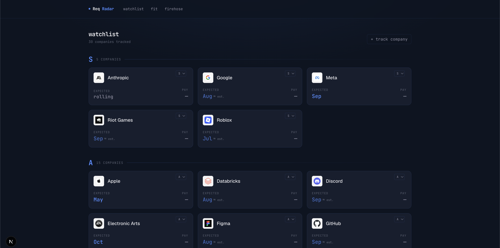
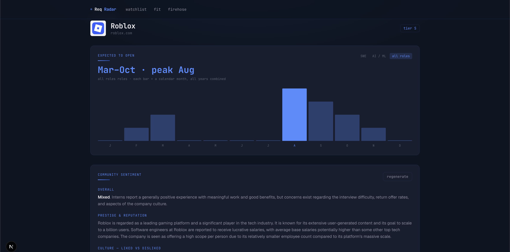
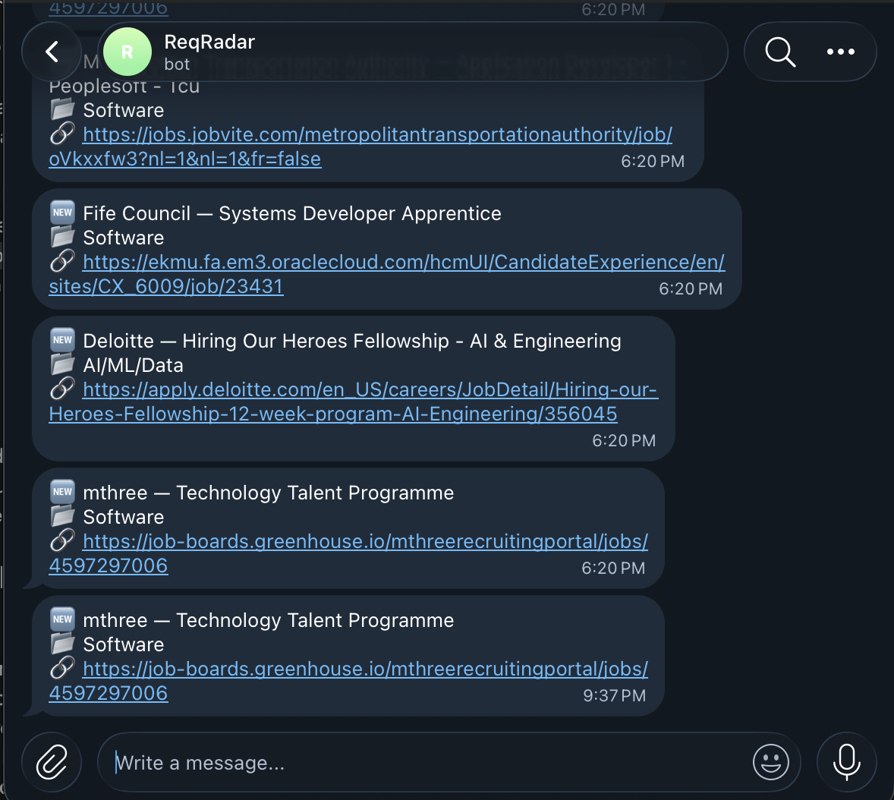
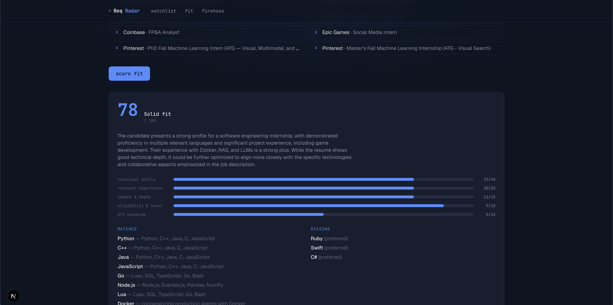
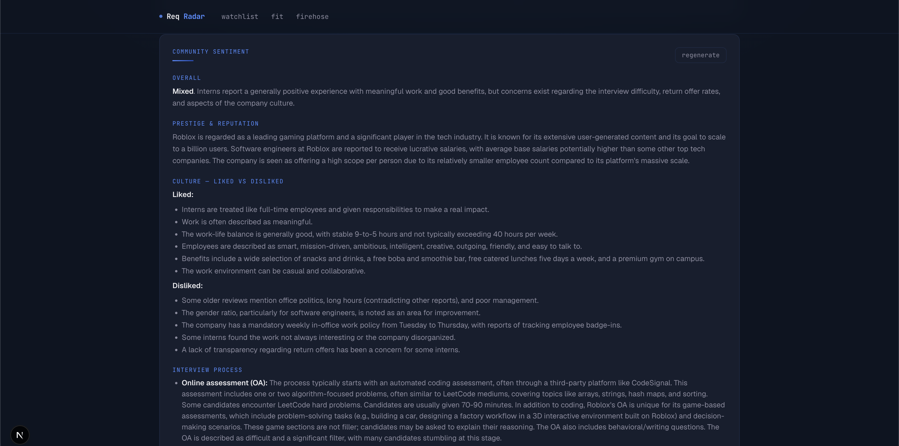
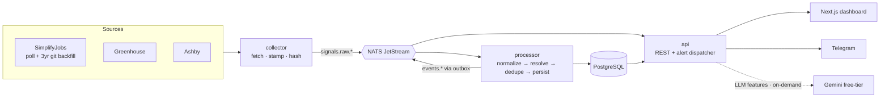

<div align="center">

# ReqRadar

**Watchlist-first hiring intelligence — a radar for when your target companies open SWE-internship applications.**

[](https://github.com/Mekski/ReqRadar/actions/workflows/ci.yml)




</div>

---

Job boards tell you what's open. ReqRadar tells you **when each of your target companies historically opens its summer SWE-intern applications — and pings your phone the moment a new role drops.** You bookmark as many target companies as you want into tiers; it mines live and 3-year-historical posting signals, resolves them to your watchlist, learns each company's seasonal opening window, and fires **sub-minute Telegram alerts** on every new role.

It's deliberately built as an **event-driven, multi-service system** — the distributed-systems, real-time-data, API-design, and CI/CD work that internship JDs actually ask for, not five cron scripts. Every component is meant to survive the interview question *"why not something simpler?"* — the simpler alternatives (Kafka, a second datastore, a monolith) were each evaluated and deliberately rejected at this scale.

---

## Features

### Tiered watchlist + "expected to open"

Bookmark any number of companies into **S / A / B / C** tiers and re-rank them inline. For each, ReqRadar aggregates historical `posting_opened` events by month-of-year to surface an **expected-open month** and a season chart — answering the question that actually drives intern recruiting timing. Data-derived where there's enough history; a researched, cited estimate (`≈ est.`) or honest `rolling` otherwise. **Adding a company auto-enriches it:** a grounded web search fills its expected-open month, and another detects which ATS it uses (Greenhouse/Ashby) — verifying the board against the live API before trusting it — so its postings get the full pipeline with no manual setup.

<div align="center"></div>

### Real-time Telegram alerts + firehose

A new role at a watchlist company pings your phone in **under a second from detection** (instrumented end-to-end; 607 ms verified). A separate **firehose** channel surfaces newly-posted SWE / AI-ML internships at companies *off* your watchlist — an early-warning net — with real posted dates and apply links. Both are recency-gated so backfills and bulk adds never flood you.

<div align="center"></div>

### Resume ↔ JD fit score *(LLM)*

Upload your résumé (PDF) and score it against any watchlist role's real job description: a rubric-calibrated **0–100** (Technical 40 / Experience 25 / Impact 15 / Eligibility 10 / ATS 10), the matched and missing skills, and concrete résumé tips. Runs on a **free-tier Gemini** model, on-demand only — never in the alert path — and every (résumé, JD) result is cached forever so each unique pair costs one call.

<div align="center"></div>

### Grounded company sentiment *(LLM)*

A one-click report per company synthesizing what engineers actually say — prestige, culture (liked vs disliked), interview process and OA difficulty, intern pay + housing stipend, return-offer rates, watch-outs, and **"ways in" beyond just applying** (referrals, hackathons, ambassador programs, recruiting events). Built on **Gemini's grounded Google Search** (real citations, nothing scraped), with a prompt that's required to say *"not enough public information found"* rather than invent specifics.

<div align="center"></div>

### Also

- **Posted-pay extraction** — parses pay ranges out of Greenhouse/Ashby JDs (conservative: shows nothing rather than wrong comp).
- **~3 years of history** — backfilled by mining the SimplifyJobs aggregator's git history.

---

## Architecture

Three Go services over NATS JetStream, one PostgreSQL, a Next.js dashboard. Single VM + Docker Compose — **no Kafka, no second datastore, no Kubernetes**, each evaluated and rejected for this scale.



- **collector** — a plugin framework: each source only fetches, stamps, and content-hashes (canonicalizing volatile fields so unchanged re-posts don't re-alert). Adding a source is one file + one registration line.
- **processor** — normalize → an entity-resolution cascade (exact → alias → domain → cache) → dedupe / version-diff → Postgres → emit `events.*`. Idempotent: replaying the stream is always safe.
- **api** — the dashboard's REST API plus the Telegram alert dispatcher, recording `detect_to_alert_ms` per alert. The LLM features live here, reached on-demand — never on the hot path.

**Reliability the alert claim actually depends on:** events are published via a **transactional outbox** (staged in the same DB transaction, published inline with a relay backstop) so a broker hiccup can't silently drop an alert; consumers have **redelivery caps + backoff** so a poison message can't hot-loop; and a failed Telegram send **redelivers** instead of being swallowed.

---

## Engineering highlights

- **Event-driven, idempotent pipeline** with JetStream replay as a first-class workflow (re-process from stored raw signals after a parser fix).
- **Transactional outbox + consumer redelivery policy** — the dual-write and at-least-once delivery story, end to end.
- **Real CI** (GitHub Actions): `lint` (golangci-lint), `unit`, `frontend` (`next build`), and an `integration` job that spins **real Postgres + NATS** to exercise the dedupe state machine and the outbox.
- **Golden-file collector tests** from captured payloads — source-format drift fails CI instead of silently dropping data.
- **`event_time` vs `observed_at`** kept distinct throughout, so 3-year backfill and sub-minute latency coexist without conflating "when it happened" with "when we saw it."
- **Every heavy choice is deliberate, and the trade-offs are written down** — NATS over a Postgres queue (with the honest "what I'd cut first" noted), a transactional outbox over fire-and-forget, and a backfill *measured* (~33s) before deciding **not** to add a cache. Judgment over cargo-culting; rejected alternatives documented.

---

## Tech stack

**Backend** — Go 1.26 · NATS JetStream · PostgreSQL 17 (`golang-migrate`) · `log/slog`
**Frontend** — Next.js 16 · React 19 · TypeScript · Tailwind 4 · react-markdown
**AI** — Gemini (free-tier): fit scoring, grounded sentiment, and grounded auto-discovery (expected-open + ATS board)
**Infra** — Docker Compose · GitHub Actions · Telegram Bot API

---

## Run locally

Needs Docker, Go 1.26, and Node. Put secrets in `.env` (gitignored): `TELEGRAM_BOT_TOKEN`, `TELEGRAM_CHAT_ID`, `GITHUB_TOKEN` (backfill), and `GEMINI_API_KEY` (the LLM features; everything else runs without it).

```sh
make dev-up          # postgres, nats (+JetStream)
make migrate         # apply schema
make seed            # load seed/watchlist.yaml
make run-collector   # poll sources → NATS
make run-processor   # consume → Postgres + events
make run-api         # REST API + Telegram dispatcher (:8080)
make backfill        # ~3 years of history (run the processor alongside)
make firehose-prime  # arm the firehose once (so the backlog doesn't all alert)

cd web && npm install && npm run dev   # dashboard → http://localhost:3000
```

Integration tests need a throwaway Postgres + NATS: `make test-integration` (see the `REQRADAR_TEST_*` env in the Makefile).

---

## Status

End-to-end and verified on a live stack, CI green: the collector → NATS → processor → Postgres pipeline; three collectors (SimplifyJobs + git-history backfill, Greenhouse, Ashby); ~3 years of backfilled timing and "expected open" seasonality across 30+ companies; posted-pay extraction; watchlist + firehose Telegram alerts; the Next.js dashboard; and the LLM features (résumé↔JD fit, grounded company sentiment + "ways in", and grounded auto-discovery that fills a newly-added company's expected-open month and ATS board on its own). A one-click **"rebuild history"** button replays the backfill on demand (~33s).

**Deployment:** the artifacts are built — a multi-stage `Dockerfile`, a production [`deploy/docker-compose.prod.yml`](deploy/docker-compose.prod.yml) (Postgres + NATS with persistent volumes, one-shot migrate/seed, `restart: unless-stopped`, API bound to localhost — the dashboard is reached over an SSH tunnel, not published), and an [Oracle Always-Free deploy guide](deploy/README.md). **Remaining:** stand it up on the VM + a CI/CD deploy step; plus an HN sentiment source and a calendar view.

> Single-user project (built for my own Summer-2027 internship search). The schema leaves the multi-user seam but there are no signup/auth flows by design.
